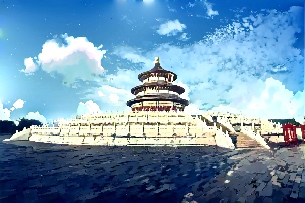
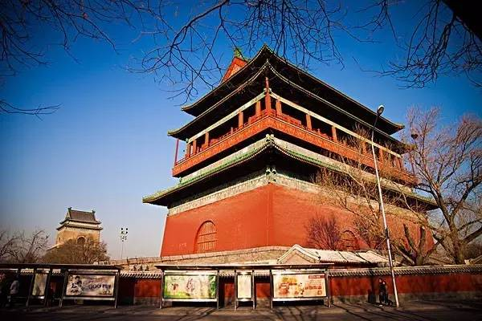
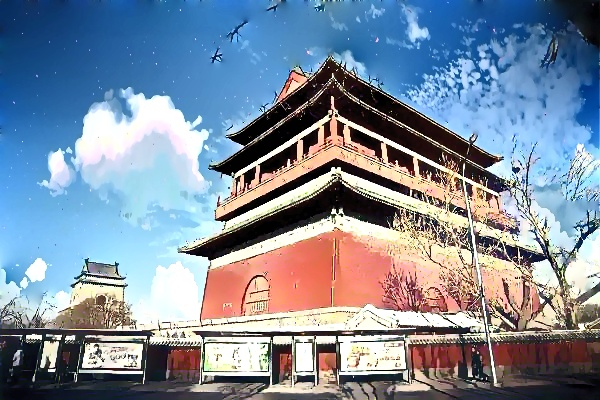

# 生成对抗网络White-box Cartoon实现新海诚动画效果
- 步骤
```python
1:数据准备
2:环境配置与模型训练验证
3:实现新海诚动画的具体逻辑
```

## 一、数据准备
```python
# 收集新海诚风格的卡通图片, 如通过新海诚的动画电影进行截帧或通过爬取相关的数据
云盘： 密码：
```

## 二、环境配置与模型训练验证
```python
# 创建python虚拟环境
/usr/local/bin/python3.6 -m venv venv
# 激活虚拟环境
source venv/bin/activate
# 切换到项目主目录执行
pip install -r requirements.txt
# 模型训练
python src/train_code/train.py
# 模型测试
python src/test_code/cartoonize.py
```

## 三、实现新海诚动画的具体逻辑
```python
# 天空分割+新海诚风格变换+图像融合
  生成卡通图
  cartoon_img = cartoonize.cartoonize(image_photo, model_path)
  生成mask掩码
  mask_img = seg.seg(model.eval(), image_seg, cfg.classes, mean, std, cfg.base_size, cfg.test_h, cfg.test_w, cfg.scales, colors)
  3通道变1通道
  mask_img = cv2.cvtColor(np.array(mask_img.convert("RGB")), cv2.COLOR_RGB2BGR)
  mask_img = cv2.cvtColor(mask_img, cv2.COLOR_RGB2GRAY)
  matDst = seamlessClone(cartoon_img, cloud, mask_img)  
# 模型推理
python demo.py
# 效果预览




```


